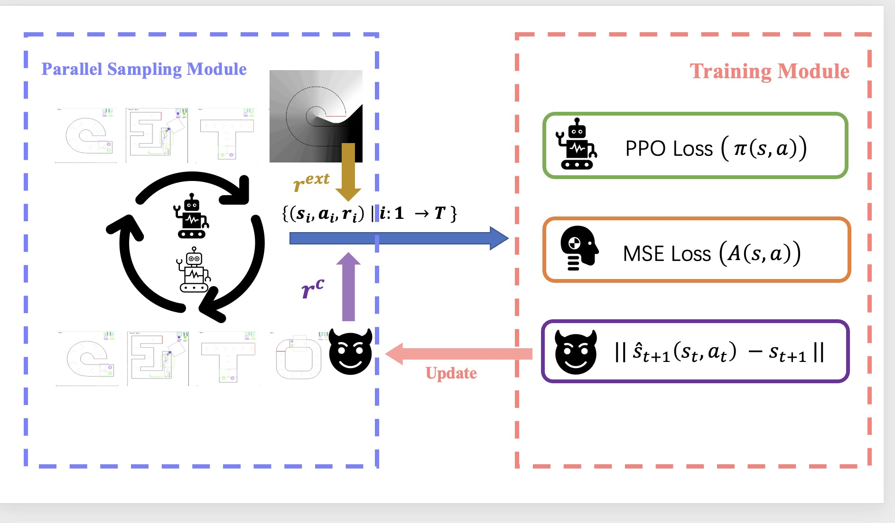
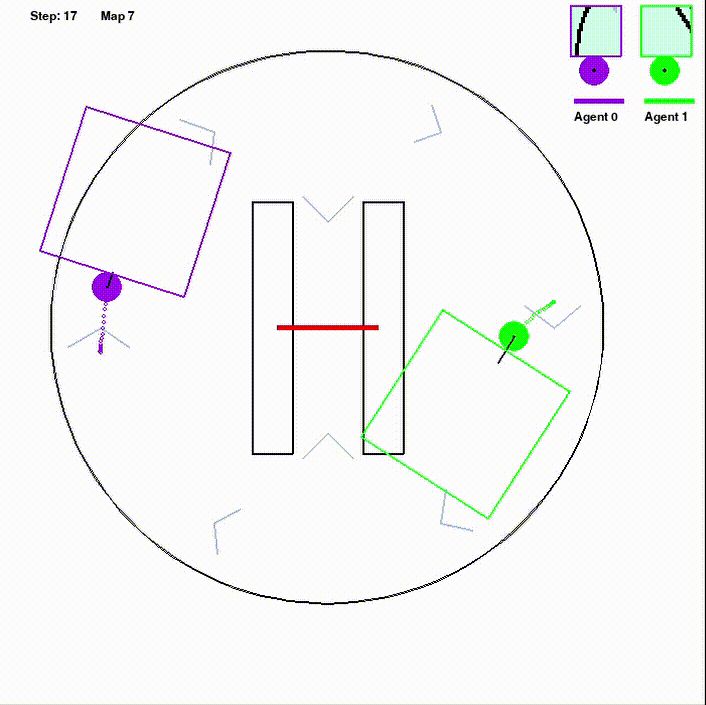

## Heuristic Reward Driven Athlete Trainer
> Use parallel framework and curiosity driven reward to train a running athlete
### Our method pipeline



### Our group

Yu Zheng (519030910354) for the parallel framework.

Jiahang Cao (519030910347) for the astar costmap and trace potential reward.

Qingquan Bao (519030910402) for the curiosity inner reawrd and self-play settings.

The expriment report is equally contributed by the three authors.

### Our method demo

**Curiosity Athlete(agent0,ours)** compete with random(agent1)


**Curiosity Athlete(agent0,ours)** compete with jidi baseline agent trained in map4 (agent1)


### Usage

- install

```shell
pip install -r requirement.txt
# pre generate costmap for astar reward
python astarmap.py
```
- training
```shell
# training baseline with map1
python rl_trainer/main.py --device cuda --map 1
# training baseline with shuffle map
python rl_trainer/main.py --device cuda --shuffle_map
# training HRDDAT best model (we trained on the 64 cpu server)
python rl_trainer/main_parallel_curiosity.py --device cuda --reward_norm --data_norm --advt_norm --curiosity --num_rollouts 36 --max_length 500 --shuffle_map --ext_ratio 0.1 --curiosity_ratio 0.9
```

- evaluation

You should change the rundir and episode to evaluate in the `submit_agent/{YOUR_AGENT_NAME}/submission.py`
```python
####################
run = 1 # choose which run package to evaluate
episode = 296 # choose which episode check point to evaluate
####################
```

To evaluate locally, add `--render` to play the UI meanwhile
```shell
# evaluate the model with random opponent
python evaluation_local.py --my_ai ppo_curiosity --opponent random --shuffle_map
# evaluate the model with jidi rl opponent
python evaluation_local.py --my_ai ppo_curiosity  --opponent rl --shuffle_map
# evaluate the baseline model(trained by main.py) with random opponent
python evaluation_local.py --my_ai ppo --opponent random --shuffle_map
```
### Acknowledgement
Modified from [https://github.com/sjtu-marl/Competition_Olympics-Running](https://github.com/sjtu-marl/Competition_Olympics-Running).
- add evaluate_local script to accept submission.py evaluation
- HRDDAT model train script added (main_parallel_curiosity.py)

The profile function(`rl_trainer/algo/prof.py`) is from https://github.com/facebookresearch/torchbeast

The parallel framework refers to https://github.com/marlbenchmark/on-policy
